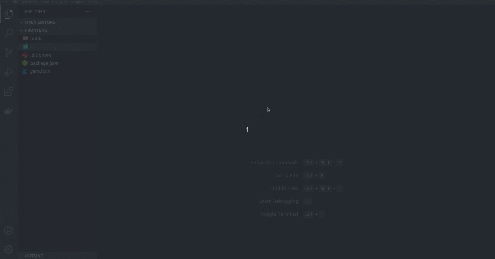

# Next.js/React/Storybook Commands

Create components, stories and pages with commands.

## Installation

- install the extension
- open command palette (ctrl + shift + p) or (cmd + shift + p)
- type sc.
- give file a name with extension.

# Usage

## React Components Commands

### sc (component in src directory)

- This command will create component directory inside src directory and then append file in it.

### rc (component in root directory)

- This command will create component directory in root and then append file in it.

## Next.js Pages Commands

### sp (page in src directory)

- This command will create pages directory inside src directory and then append file in it.

### rp (page in root directory)

- This command will create pages directory inside root and then append file into it.

## Storybook Components Commands

### ss (story in src directory)

- This command will create stories directory inside src directory and the append story in it.

### rs (story in root directory)

- This command will create a stories directory and then append story file in it.
